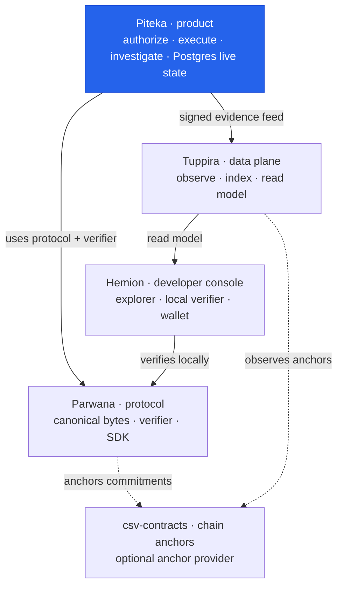

# Piteka

Piteka is the enterprise accountability workbench. The first release is a
Rust modular monolith: one Axum process with pure domain rules, application
use cases and ports, and infrastructure adapters separated into inward-pointing
workspace crates.

## Topology

Where Piteka sits in the DieWan Accountability Platform:

**You are here — Piteka**, the product/workflow layer. It authorizes actions as
**mandates**, executes them once, records **receipts**, owns the single source of
live deployment state (PostgreSQL), and exports signed **evidence** that can be
**anchored**. It *uses* [Parwana](../parwana) for protocol
meaning and verification (never re-implementing it), feeds [Tuppira](../tuppira),
which [Hemion](../hemion) reads. See the org charter in
[`development/ARCHITECTURE.md`](../development/ARCHITECTURE.md).

## Glossary

Key terms a newcomer will meet in Piteka:

| Term | Kind | Plain-English meaning | Real-world example |
|------|------|-----------------------|--------------------|
| Accountability | Keyword | Earning authority, trust, and payment by providing independently verifiable evidence of what you were allowed to do, did, and now owe. | A contractor gets paid because they can prove the fix they shipped is the fix they were authorized to make. |
| Mandate | Data structure | A *pre-action* authorization artifact — permission granted before the act. | A signed work order: "you may deploy service X to prod, exactly once." |
| Receipt | Data structure | Evidence of what actually happened, cryptographically bound to its mandate. | A deploy log entry that proves it came from that approval. |
| Evidence | Keyword | The verifiable records — mandates and receipts — that establish integrity (not necessarily truth). | The signed documents in a case file an auditor can independently check. |
| Commitment | Keyword | The canonical cryptographic summary of state that a chain can anchor. | A hash fingerprint that pins exactly what was approved and done. |
| Anchor | Keyword | Publishing a commitment to a chain as optional timestamp/settlement evidence. | A notary stamp proving the record existed at a point in time. |
| Verifier | Component | The side-effect-free logic that turns evidence + rules into a deterministic verdict. | A referee applying a fixed rulebook to reach the same call every time. |

Local configuration in `config/local.toml` is deliberately secret-free.
Credentials must be supplied through environment variables and must never be
committed.

